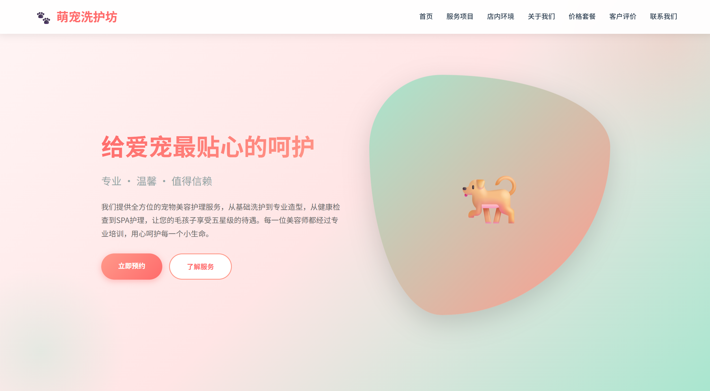

# 🐾 宠物洗护店官网 · Pet Grooming Shop Website

> 🌟 专为宠物洗护店打造的静态展示型官网，界面清新友好，适配多端浏览体验。

---

<div align="center">


</div>

---

## 📸 项目预览


<div align="center">
  
  <p><em>网站首页效果预览</em></p>
</div>

---

## ✨ 项目亮点

- 🐶 **友好界面**：以宠物为主题的清新配色，视觉舒适
- 📱 **基础适配**：兼顾 PC 端浏览体验
- 📋 **功能完整**：服务介绍、价格展示、门店信息一应俱全
- ⚡ **纯静态项目**：无需后端，直接打开即可运行

---

## 🛠 技术栈

<div align="left">
  
  
</div>

---

## 📁 项目结构

```text
pet_grooming_shop/
├── images/              # 图片资源文件夹
│   └── preview.png      # 预览图（可自行添加）
├── 宠物洗护店.html      # 主页面入口
├── .gitignore           # Git 忽略文件
└── README.md            # 项目说明文档
```

---

## 🚀 快速上手

1. **克隆仓库**
   ```bash
   git clone git@github.com:EnintHjl/pet_grooming_shop.git
   cd pet_grooming_shop
   ```

2. **直接运行**
   - 双击打开 `宠物洗护店.html`
   - 或在 VS Code 中使用 Live Server 插件运行

3. **部署上线**
   可直接部署到 GitHub Pages、Vercel 或其他静态网站托管平台。

---

## 📧 关于作者

- GitHub：[@EnintHjl](https://github.com/EnintHjl)
- 邮箱：3268382526@qq.com

> 如果这个项目对你有帮助，欢迎点个 ⭐ Star 支持一下！
